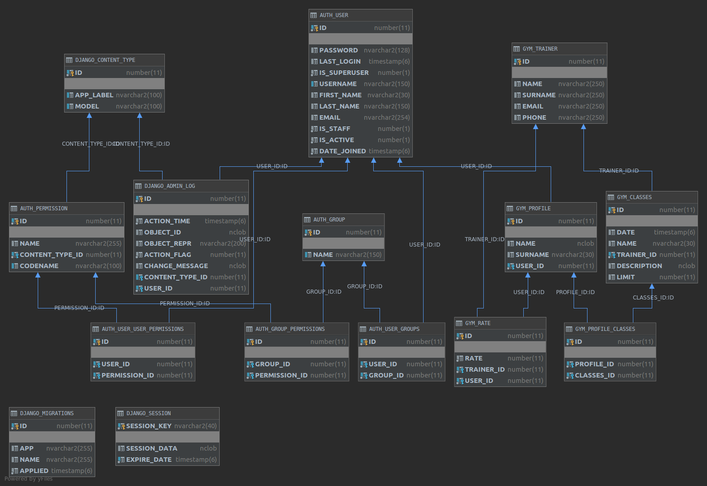

Projekt z przedmiotu Bazy danych.
- Magdalena Badura, Jadwiga Uljasz

Aplikacja dla klientów siłowni.
- Framework: Django, Boostrap4
- Baza danych: Oracle

## Opis projektu
Aplikacja pozwala na autentykację klientów siłowni. Klient może zapisywać się na zajęcia, oceniać prowadząceog zajęć, w których brał udział i wyświetlić listę zajęć i przeglądać strony z informacjami na temat zajęć i trenerów.

Dodawanie zajęć możliwe jest po wejściu na podstronę /admin i zalogowaniu się jako superuser.

## Modele
Trainer - model trenera, ma pola:
* name
* surname
* email
* phone

Classes - model zajęć, ma pola:
* trainer - trener prowadzący zajęcia (Foreign Key)
* date - data zajęć w formacie
* name - nazwa
* description - opis zajęć
* limit - limit uczestników; po osiągnięciu limitu zapis na zajęcia zamyka się

Profile - model profilu użytkownika, jest modelem wbudowanego modelu User, ma pola:
* user - relacja jeden-to-jeden, łączy model Profile z modelem User, ułatwia to autentykację
* name - imię
* surname - nazwisko
* classes - relacja wiele-do-wielu, lista zajęć użytkownika (przeszłych i przyszłych)

Rate - model oceny, ma pola:
* trainer - id ocenianego trenera (Foreign Key)
* user - id oceniającego użytkownika (Foreign Key)
* rate - ocena w zakresie 1-5

RateOptions - model enumarated, "tłumaczy" oceny w zakresie 1-5 na opisy słowne

## Struktura:

* [models.py](./gym/models.py) - modele Trainer, Classes, Profile, Rate

* [urls.py](./BD_projekt/urls.py) - nawigacja aplikacji

* [gym.views](./gym/views.py) - widoki dotyczące wyświetlania zajęć i trenerów, strona główna

* [users.views.py](./users/views.py) - widoki dotyczące rejestracji, logowania, strona z profilem użytkownika

* [gym.templates](./gym/templates) - szablony HTML stron dotyczących wyświetlania zajęć i trenerów i strony głównej

* [users.templates](./users/templates) - szablony HTML stron dotyczących rejestracji, logowania i strony z profilem użytkownika


## Instrukcja do łączenia się z Oraclem przez Dockera

Należy stworzyć konto w Docker Hub:
https://hub.docker.com/ i uzyskać dostęp [Docker Image](https://hub.docker.com/_/oracle-database-enterprise-edition)

Trzeba pobrać też narzędzia potrzebne do uruchomienia SQLPlusa:
https://www.oracle.com/database/technologies/instant-client/linux-x86-64-downloads.html

Wybieramy
"Instant Client Package - Basic" i "Instant Client Package - SQL*Plus" dla wersji 12.2.0.1.0.

Na przykład dla systemu Linux x86-64 wybieramy:
```
oracle-instantclient12.2-basic-12.2.0.1.0-1.x86_64.rpm 
oracle-instantclient12.2-sqlplus-12.2.0.1.0-1.x86_64.rmp 
```

Wykonujemy polecenia:
```
sudo alien -i oracle-instantclient12.2-basic-12.2.0.1.0-1.x86_64.rpm
sudo alien -i oracle-instantclient12.2-sqlplus-12.2.0.1.0-1.x86_64.rpm
sudo -- bash -c 'echo "/usr/lib/oracle/12.2/client64/lib/" > /etc/ld.so.conf.d/oracle.conf'
sudo ldconfig
sudo ln -s /usr/bin/sqlplus64 /usr/bin/sqlplus
```

Polecenia do utworzenia containera:

```
docker login
docker run -d -it --name <DB_NAME> store/oracle/database-enterprise:12.2.0.1
sudo alien -i oracle-instantclient*-basic*.rpm
sqlplus sys/Oradoc_db1@localhost/ORCLCDB.localdomain as sysdba
```


W konsoli sqlplusa wykonujemy:

```
SQL> ALTER SESSION SET CONTAINER=ORCLPDB1;
SQL> ALTER SESSION SET "_ORACLE_SCRIPT"=true;
SQL> CREATE USER django IDENTIFIED BY django;
SQL> GRANT DBA TO django;
SQL> QUIT
```

Uruchamianie istniejącego containera:
```
docker start <DB_NAME>
```


## Łączenie się z bazą przez DataGripa


## Diagram bazy




## Przewodnik po kodzie
[users.templates](./users/templates) - szablony HTML stron dotyczących rejestracji, logowania i strony z profilem użytkownika


### [models.py](./gym/models.py)

Można tutaj zobaczyc jak tworzymy tabele korzystając z tego że django wspiera bazę oracle i wręcz zalecane jest by zmiany wprowadzać korzystając z gotowych narzędzi bez bezpośredniej modyfikacji. 
Tworząc klasy możemy również tworzyć funkcję pomocnicze jak get_fields.

```python
class Trainer(models.Model):
    name = models.CharField(max_length=250)
    surname = models.CharField(max_length=250)
    email = models.CharField(max_length=250)
    phone = models.CharField(max_length=250)
     
    def __str__(self):
        return self.name + " " + self.surname

    def get_rate(self):
        rates = self.rate_set.all()
        if len(rates) <= 0:
            return '<no rates yet>'
        mean_rate = mean(item.rate for item in rates)
        closest_rate = int(round(mean_rate, 2))
        if(closest_rate > 0): closest_rate = closest_rate - 1
        return f'{round(mean_rate, 2)}-{R_O[closest_rate][1]}'


```

```python
class Classes(models.Model):
    trainer = models.ForeignKey(Trainer, on_delete=models.CASCADE)
    date = models.DateTimeField()
    name = models.CharField(max_length=30)
    description = models.TextField(max_length=250, default='class description', editable=True)
    is_favourite = models.BooleanField(default=False)
    limit = models.PositiveIntegerField(null=True, default=15)

    def get_participants_number(self):
        signed_number = self.profile_set.all().count()
        return signed_number

    def can_sign(self):
        return self.limit is None or self.seats_left() > 0

    def seats_left(self):
        if self.limit is None:
            return 'no limit'
        return self.limit - self.get_participants_number()

    def name_and_date(self):
        day_of_week = self.date.strftime('%A %H:%M, %-d %B %Y')
        return '{} - {}'.format(self.name, day_of_week)

    def __str__(self):
        day_of_week = self.date.strftime('%A %H:%M, %-d %B %Y')
        return '{} - {} ({})'.format(self.name, self.description, day_of_week)
```

```python
class Profile(models.Model):
    user = models.OneToOneField(User, on_delete=models.CASCADE)
    name = models.TextField(max_length=500, null=True)
    surname = models.CharField(max_length=30, null=True)
    classes = models.ManyToManyField(Classes)

    def get_future_classes(self):
        return self.classes.filter(date__gt=datetime.utcnow().strftime('%Y-%m-%d %H:%M:%S'))

    def get_past_classes(self):
        return self.classes.filter(date__lt=datetime.utcnow().strftime('%Y-%m-%d %H:%M:%S'))

    def get_fields(self):
        return [(field.name, field.value_to_string(self)) for field in Profile._meta.fields]

    @receiver(post_save, sender=User)
    def create_user_profile(sender, instance, created, **kwargs):
        if created:
            Profile.objects.create(user=instance)

    @receiver(post_save, sender=User)
    def save_user_profile(sender, instance, **kwargs):
        instance.profile.save()
```

Mozna równiez dodawać constrainty uniwmożliwiające wprowadzenie złych danych. Np ograniczenie że jedna osoba może tylko raz ocenc jednego trener jak poniżej:i
```python

class Rate(models.Model):
    trainer = models.ForeignKey(Trainer, on_delete=models.CASCADE)
    user = models.ForeignKey(Profile, on_delete=models.CASCADE)
    rate = models.IntegerField(choices=R_O)

    class Meta:
        constraints = [
            models.UniqueConstraint(fields=['trainer', 'user'], name='one_time_rating_trainer'),
        ]
```

Do danych widoków możemy przekazywać potrzebne nam elementy z bazy np wtybierając metodą get która jest równoażna zapytaniu SELECT * FROM ... WHERE
```python
def trainers_details(request, trainer_id):

    trainer = Trainer.objects.get(pk=trainer_id)
    return render(request, 'gym/trainers_details.html', {'trainer': trainer})
```
